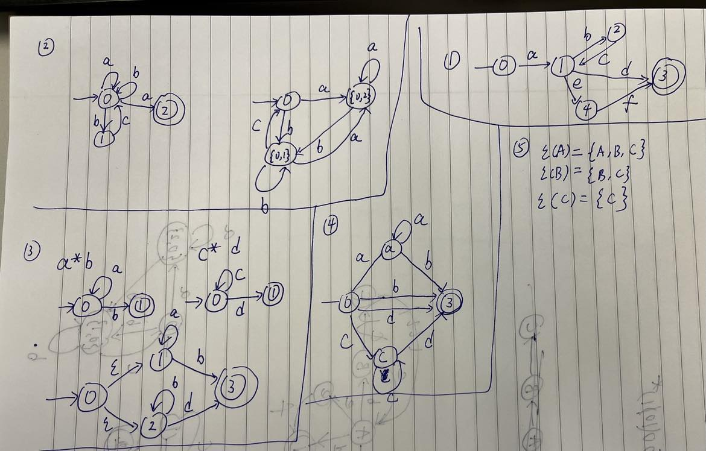

> Based on the work of Tobias Lowenthal.

# Question 1

**1.1**

1. type
2. identifier
3. operator
4. number
5. keyword
6. special
7. string
8. whitespaceOrComment

**1.2**

```
<type, int><whitespaceOrComment><identifier, x2><whitespaceOrComment>
<operator, =><whitespaceOrComment><number, 25><special, ;><whitespaceOrComment>
<keyword, while><special, (> 
...
<special, }><whitespaceOrComment>
```

**1.3**

1. type : `int`
2. identifier: `[a-zA-Z_][a-zA-Z0-9_]*`
3. number: `[1-9][0-9]*`
4. keyword: `while|if`
5. special: `{|}|(|)|;|++|-|%|<=|>|=|,`
6. string: `"".*"`
7. whitespaceOrComment `\s+|//.*`

# Question 2

**2.1**

It stands for all binary numbers containing ast least two 0s.

**2.2**

`1(01|1)*00(10|1)*`

# Question 3



**3.6**

I don't understand what is power set.