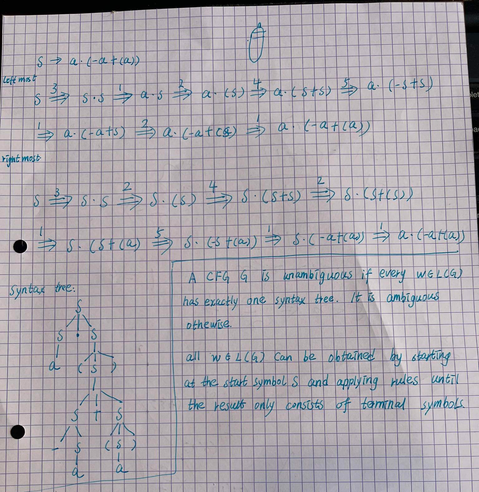

> Based on the work of Tobias Lowenthal.

# Question 1

1. `a ( ) . + -`
2. see 

**1.4**

-a+a with left-most derivation :

- Can do S =5=> -S =4=> -S+S =1=> -a+S =1=> -a+a 5411
- But also S =4=> S+S =5=> -S+S =1=> -a+S =1=> -a+a 4511
- Both leftmost derivation but different syntax tree

# Question 2

**2.1**

```
E → E + T | E - T | T
T → T ∗ F | T / F | F
F → ( E ) | Number | Identifier
```

**2.2**

For `3 + 4 / 5`:

```
E   -> E + T
    -> T + T
    -> F + T
    -> 3 + T
    -> 3 + T / F
    -> 3 + F / F
    -> 3 + 4 / F
    -> 3 + 4 / 5
```

AST:

```
  +
 / \
 3  /
   / \
  4   5
```

or

```
    Additive
    /   |   \
   3    +    Multiplicative
                /   |   \
               4    /    5
```

**2.3**

Add a new operator "<" for the grammar:

```
E -> H < H | H
H → H + T | H - T | T
T → T ∗ F | T / F | F
F → ( E ) | Number | Identifier
```

Rule for `4 + 7 < 3 + 4 / 5`

```
E   -> H < H              // rule 1
    -> H + T < H          // rule 3
    -> T + T < H          // rule 5
    -> F + T < H          // rule 8
    -> 4 + T < H          // rule 10
    -> 4 + F < H          // rule 8
    -> 4 + 7 < H          // rule 10
    -> 4 + 7 < H + T      // rule 3
    -> 4 + 7 < T + T      // rule 5
    -> 4 + 7 < F + T      // rule 8
    -> 4 + 7 < 3 + T      // rule 10
    -> 4 + 7 < 3 + T / F  // rule 7
    -> 4 + 7 < 3 + F / F  // rule 8
    -> 4 + 7 < 3 + 4 / F  // rule 10
    -> 4 + 7 < 3 + 4 / 5  // rule 10
```

AST:

```
    <
   / \
  +   +
 / \ / \
4  7 3  /
      / \
     4   5
```


    