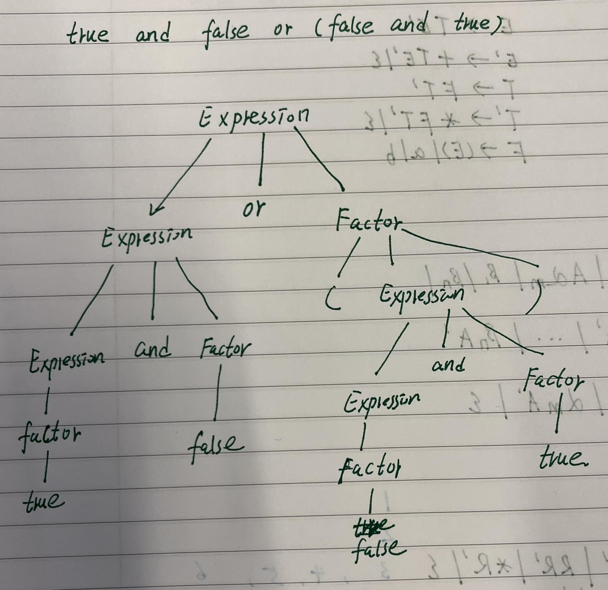

> Based on the work of Tobias Lowenthal and TP answers from discord.

# Question 1

1. A regular language can be expressed by a regular expression.
2. Regular expressions can be converted to NFAs
3. NFAs can be converted to DFAs
4. The state transitions of the DFA can be expressed as a table
5. A LL(1) parser can be constructed from the table.

# Question 2

## 2.1

```

S -> R                             // Rule 1
R -> TR'                           // Rule 2
R' -> +RR' | RR' | *R' | epsilon   // Rule 3, 4, 5, 6
T -> (R) | a | b                   // Rule 7, 8, 9
```

```
S -> R.
R -> TQ.
Q -> add RQ. 
Q -> RQ .
Q -> times Q. 
Q ->  .
T -> lp R rp. 
T ->  a. 
T ->  b.
```

Why the grammar is LL(1):

* reason 1: [link](https://mdaines.github.io/grammophone/#/)
* reason 2: 

1. `R' -> +RR' | RR' | *R' | epsilon`
    $$la(R' -> +RR') = \{+\}$$

    $$la(R' -> RR') = \{a, b, (, \epsilon\}$$

    $$la(R' -> *R') = \{\*\}$$

    $$la(R' -> \epsilon) = \epsilon$$

    There is no intersections between the sets, so the grammar is LL(1).

2. `T -> (R) | a | b`
    $$la(T -> (R)) = \{\emptyset\}$$

    $$la(T -> a) = \{a\}$$

    $$la(T -> b) = \{b\}$$

    There is no intersections between the sets, so the grammar is LL(1).

## 2.2

|         | S      | R        | R'           | T      |
|---------|--------|----------|--------------|--------|
| a       | (R, 1) | (TR', 2) |              | (a, 8) |
| b       | (R, 1) | (TR', 2) |              | (a, 9) |
| (       | (R, 1) | (TR', 2) |              | (a, 7) |
| )       |        |          |              |        |
| +       |        |          | (+RR', 3)    |        |
| *       |        |          | (*R', 5)     |        |
| epsilon |        |          | (epsilon, 6) |        |


## 2.3

Run the NTA for the input `a + (b*)`

```
initial state:                      ( a + (b*), S, epsilon)
Rule 1 to expand S:                 ( a + (b*), R, 1)
Rule 2 to expand R:                 ( a + (b*), TR', 12)
Rule 8 to expand T:                 ( a + (b*), aR', 128)
Matched a:                          ( + (b*), R', 128)
Rule 3 to expand R':                ( + (b*), +RR', 1283)
Matched +:                          ( (b*), RR', 1283)
Rule 2 to expand R:                 ( (b*), TR'R', 12832)
Rule 7 to expand T:                 ( (b*), (R)R'R', 128327)
Matched (:                          ( b*), R)R'R', 128327)
Rule 2 to expand R:                 ( b*), TR')R'R', 1283272)
Rule 9 to expand T:                 ( b*), bR')R'R', 12832729)
Matched b:                          ( *), R')R'R', 12832729)
Rule 5 to expand R':                ( *), *R')R'R', 128327295)
Matched *:                          ( ), R')R'R', 128327295)
Rule 6 to expand R':                ( ), )R'R', 1283272956)
Matched ):                          ( , R'R', 1283272956)
Rule 6 to expand R':                ( , R', 12832729566)
Rule 6 to expand R':                ( , , 128327295666)
```


# Question 3

## 3.1



## 3.2

```
Expression -> Factore Exp'
Exp' -> or Factor Expr' | and Factor Exp' | epsilon
Factor -> not Factor | (Expression) | true | false
```

## 3.3

see [TP3.java](TP3/TP3.java)
