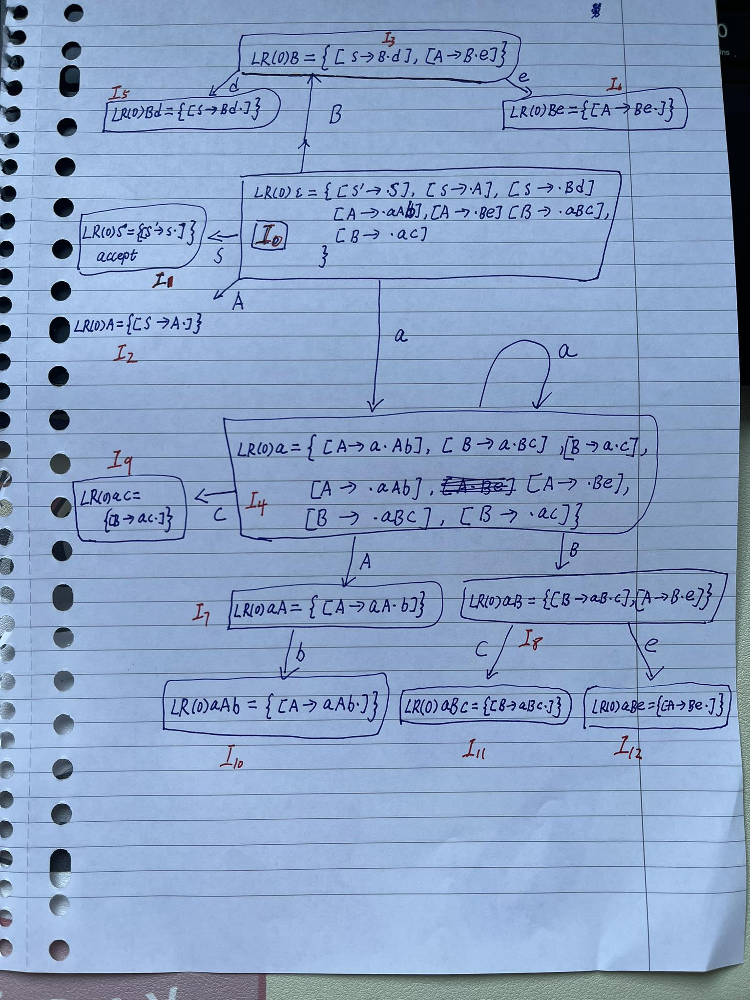
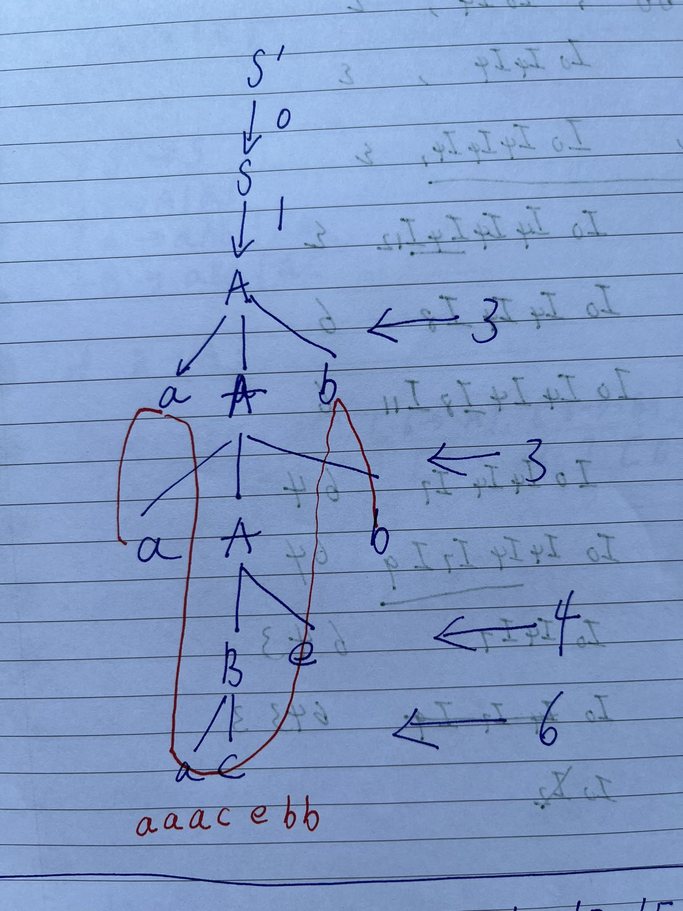
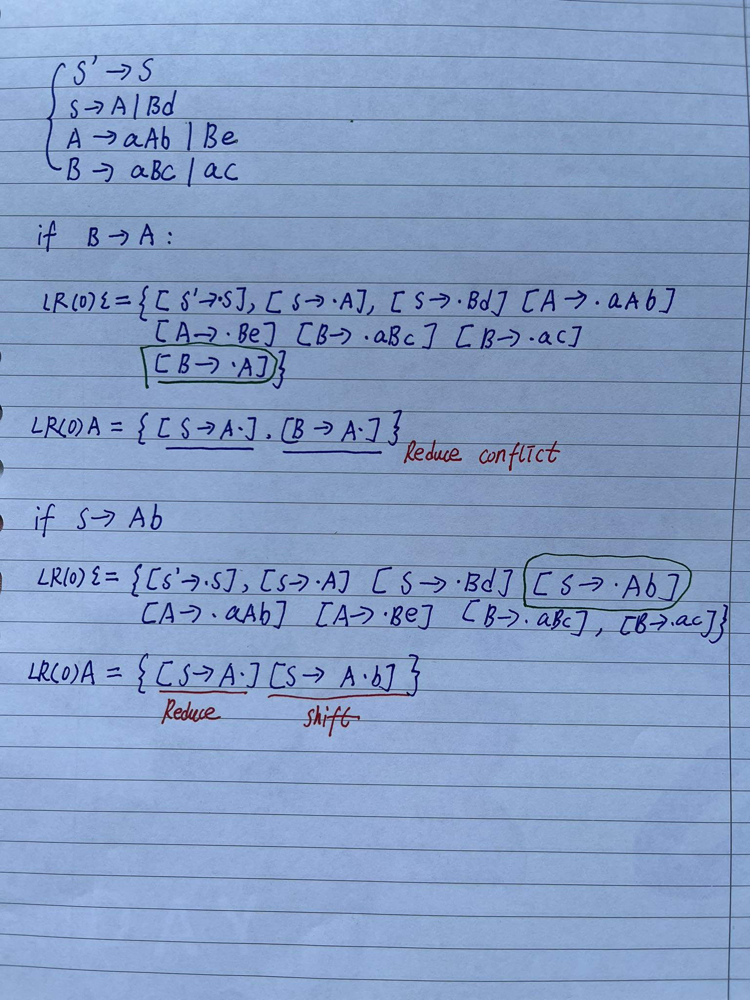

> Based on the work of Tobias Lowenthal and TP answers from discord.

# Question 1

The goal of a parser is to construct an AST.
LL(0) means the parser can decide which rule to apply without knowing the input,
which means it can not to do choices.

Let us consider the following grammar:

```
A -> B | C
B -> a
C -> a
```

This grammar is a basic one, but it is not LL(0).

# Question 2

```
S'  → S             // rule 0
S   → A | Bd        // rule 1, 2
A   → aAb | Be      // rule 3, 4
B   → aBc | ac      // rule 5, 6
```

## 2.1

**goto automaton**



**action table**

|     | S  | A  | B  | a  | b   | c   | d  | e   | action   |
|-----|----|----|----|----|-----|-----|----|-----|----------|
| I0  | I1 | I2 | I3 | I4 |     |     |    |     | shift    |
| I1  |    |    |    |    |     |     |    |     | ACCEPT   |
| I2  |    |    |    |    |     |     |    |     | reduce 1 |
| I3  |    |    |    |    |     |     | I5 | I6  | shift    |
| I4  |    | I7 | I8 | I4 |     | I9  |    |     | shift    |
| I5  |    |    |    |    |     |     |    |     | reduce 2 |
| I6  |    |    |    |    |     |     |    |     | reduce 4 |
| I7  |    |    |    |    | I10 |     |    |     | shift    |
| I8  |    |    |    |    |     | I11 |    | I12 | shift    |
| I9  |    |    |    |    |     |     |    |     | reduce 6 |
| I10 |    |    |    |    |     |     |    |     | reduce 3 |
| I11 |    |    |    |    |     |     |    |     | reduce 5 |
| I12 |    |    |    |    |     |     |    |     | reduce 4 |
| I13 |    |    |    |    |     |     |    |     | error    |


## 2.2

$$fi(S -> A) = \{a\}$$

$$fi(S -> Bd) = \{a\}$$

$$fi(S -> A) \cap fi(S -> Bd) = \{a\} != /emptyset$$

So the grammar is not LL(1).

## 2.3

For `aaacebb`

| input   | states          | rule  |
|---------|-----------------|-------|
| aaacebb | I0              |       |
| aacebb  | I0,I4           |       |
| acebb   | I0,I4,I4        |       |
| cebb    | I0,I4,I4,I4     |       |
| ebb     | I0,I4,I4,I4,I9  |       |
| ebb     | I0,I4,I4,I8     | 6     |
| bb      | I0,I4,I4,I8,I12 | 6     |
| bb      | I0,I4,I4,I7     | 64    |
| b       | I0,I4,I4,I7,I10 | 64    |
| b       | I0,I4,I7        | 643   |
|         | I0,I4,I7,I10    | 643   |
|         | I0,I2           | 6433  |
|         | I0,I1           | 64331 |

**Evaluation**




## 2.4



