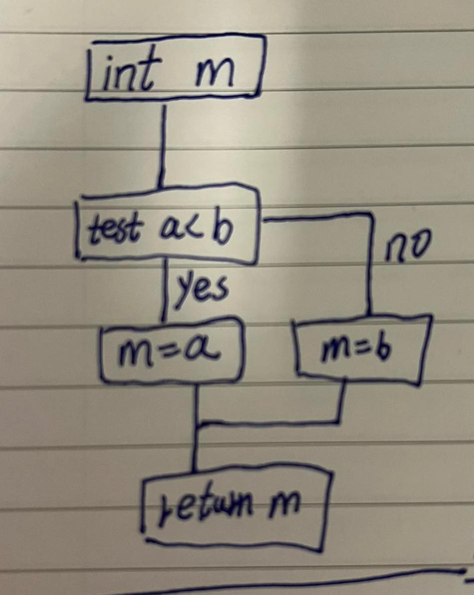
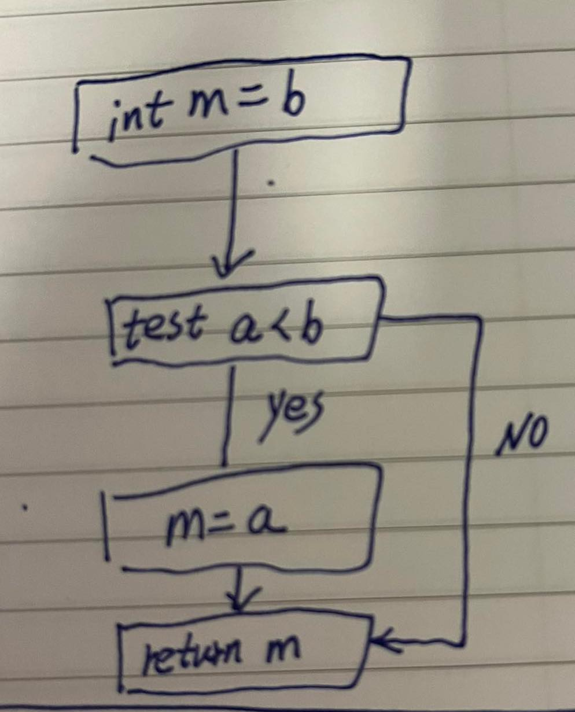
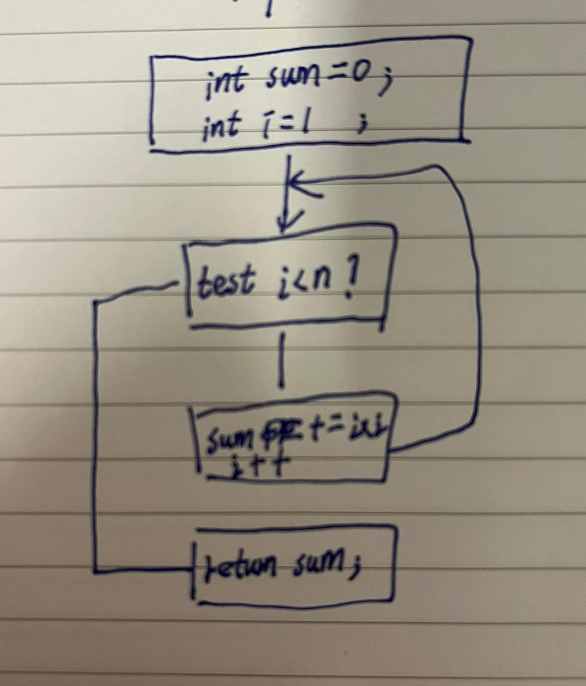

> Based on the work of TP answers from discord.

# Question 1

Give the intermediate representation in TAC for the following expression:

`x = (-b + sqrt(b^2 - 4*a*c)) / (2*a)`

**Answer**

```
t0 = b * b
t1 = 4 * a
t2 = t1 * c
t3 = t0 - t2
t4 = sqrt(t3)
t5 = -b
t6 = t5 + t4
t7 = 2 * a
x = t6 / t7
```

# Question 2

For each of the following C functions, give the control flow graph (CFG), the
minimized SSA form, and the non-SSA form without parameterized labels (the
form that can be used to generate assembly code).

## 2.1

```
int min(int a, int b) {
    int m;
    if(a<b)
        m = a;
    else
        m = b;
    return m;
}
```

**CFG**



**SSA**

```
min(a0, b0):
    if a0 < b0 goto if() else goto else()
if():
    m0 = a0
    goto L3(m0)
else():
    m0 = b0
    goto L3(m0)
done(m0):
    // m0 = Φ(a0, b0)
    return m
```

**Non-SSA**

```
min(a0, b0):
    if a0 < b0 goto if() else goto else()
if():
    m0 = a0
    goto L3()
else():
    m0 = b0
    goto L3()
done():
    return m0
```

## 2.2

```
int minAlternative(int a, int b) {
    int m = b;
    if(a<b)
        m = a;
    return m;
}
```

**CFG**



**SSA**

```
minAlternative(a0, b0):
    m0 = b0
    goto if(m0, a0, b0)
if(m1, a1, b1):
    // m1 = Φ(m0) a1 = Φ(a0) b1 = Φ(b0)
    if a0 < b0 goto body(m1, a1, b1) else goto done(m1, a1, b1)
body(m2, a2, b2):
    // m2 = Φ(m1) a2 = Φ(a1) b2 = Φ(b1)
    m3 = a2
    goto done(m3, a2, b2)
done(m4, a3, b3):
    // m4 = Φ(m1, m3) a3 = Φ(a1, a2) b3 = Φ(b1, b2)
    return m4
```

```
minAlternative(a0, b0):
    m0 = b0
    goto if()
if():
    if a0 < b0 goto body(m0, a0, b0) else goto done(m0, a0, b0)
body(m2, a2, b2):
    // m2 = Φ(m0) a2 = Φ(a0) b2 = Φ(b0)
    m3 = a2
    goto done(m3, a2, b2)
done(m4, a3, b3):
    // m4 = Φ(m0, m3) a3 = Φ(a0, a2) b3 = Φ(b0, b2)
    return m4
```

```
minAlternative(a0, b0):
    m0 = b0
    goto if()
if():
    if a0 < b0 goto body() else goto done(m0)
body():
    m3 = a0
    goto done(m3)
done(m4):
    // m4 = Φ(m0, m3)
    return m4
```

```
minAlternative(a0, b0):
    m0 = b0
    goto if()
if():
    if a0 < b0 goto body() else goto done(m0)
body():
    m3 = a0
    goto done(m3)
done(m4):
    // m4 = Φ(m0, m3)
    return m4
```

**Non-SSA**

```
minAlternative(a0, b0):
    m0 = b0
    goto if()
if():
    if a0 < b0 goto body() else goto done()
body():
    m0 = a0
    goto done()
done():
    return m0
```

## 2.3

```
int squareSum(int n) {
    int sum=0;
    for(int i=1;i<=n;i++){
        sum += i*i;
    }
    return sum;
}
```

**CFG**



**SSA**

```
squareSum(n0):
    sum0 = 0
    i0 = 1
    goto loop(sum0, i0, n0)
loop(sum1, i1, n1):
     // sum1 = Φ(sum0, sum3) i1 = Φ(i0, i3) n1 = Φ(n2, n0)
     if i1 < n1 goto body(sum1, i1, n1) else goto done(sum1, i1, n1)
body(sum2, i2, n2):
    // sum2 = Φ(sum1) i2 = Φ(i1) n2 = Φ(n1)
    t0 = i2 * i2
    sum3 = sum2 + t0
    i3 = i2 + 1
    goto loop(sum3, i3, n2)
done(sum4, i4, n3):
    // sum4 = Φ(sum1) i4 = Φ(i1) n3 = Φ(n1)
    return sum4
```

```
squareSum(n0):
    sum0 = 0
    i0 = 1
    goto loop(sum0, i0, n0)
loop(sum1, i1, n1):
     // sum1 = Φ(sum0, sum3) i1 = Φ(i0, i3) n1 = Φ(n0, n1)
     if i1 < n1 goto body() else goto done()
body():
    t0 = i1 * i1
    sum3 = sum1 + t0
    i3 = i1 + 1
    goto loop(sum3, i3, n1)
done():
    return sum1
```

```
squareSum(n0):
    sum0 = 0
    i0 = 1
    goto loop(sum0, i0)
loop(sum1, i1):
     // sum1 = Φ(sum0, sum3) i1 = Φ(i0, i3) 
     if i1 < n0 goto body() else goto done()
body():
    t0 = i1 * i1
    sum3 = sum1 + t0
    i3 = i1 + 1
    goto loop(sum3, i3)
done():
    return sum1
```

**Non-SSA**

```
squareSum(n0):
    sum0 = 0
    i0 = 1
    sum1 = sum0
    i1 = i0
    goto loop(sum1, i1)
loop(sum1, i1):
     // sum1 = Φ(sum1, sum3) i1 = Φ(i1, i3) 
     if i1 < n0 goto body() else goto done()
body():
    t0 = i1 * i1
    sum3 = sum1 + t0
    i3 = i1 + 1
    goto loop(sum3, i3)
done():
    return sum1
```

```
squareSum(n0):
    sum0 = 0
    i0 = 1
    sum1 = sum0
    i1 = i0
    goto loop()
loop():
     if i1 < n0 goto body() else goto done()
body():
    t0 = i1 * i1
    sum3 = sum1 + t0
    sum1 = sum3
    i3 = i1 + 1
    i1 = i3
    goto loop()
done():
    return sum1
```

```
squareSum(n0):
    sum0 = 0
    i0 = 1
    goto loop()
loop():
     if i0 < n0 goto body() else goto done()
body():
    t0 = i0 * i0
    sum3 = sum0 + t0
    sum0 = sum3
    i3 = i1 + 1
    i0 = i3
    goto loop()
done():
    return sum0
```