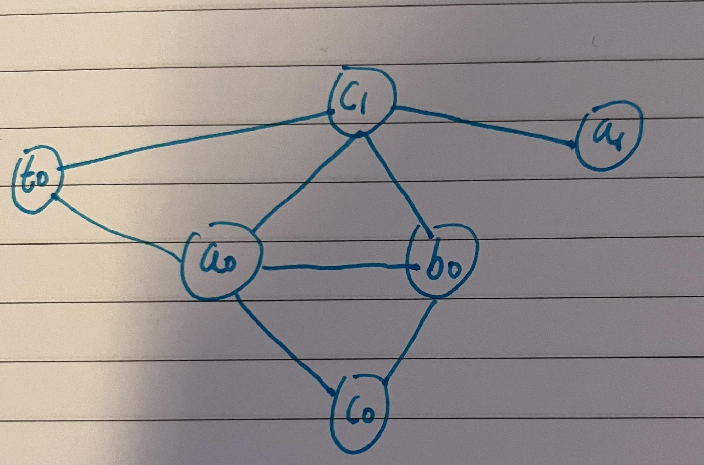
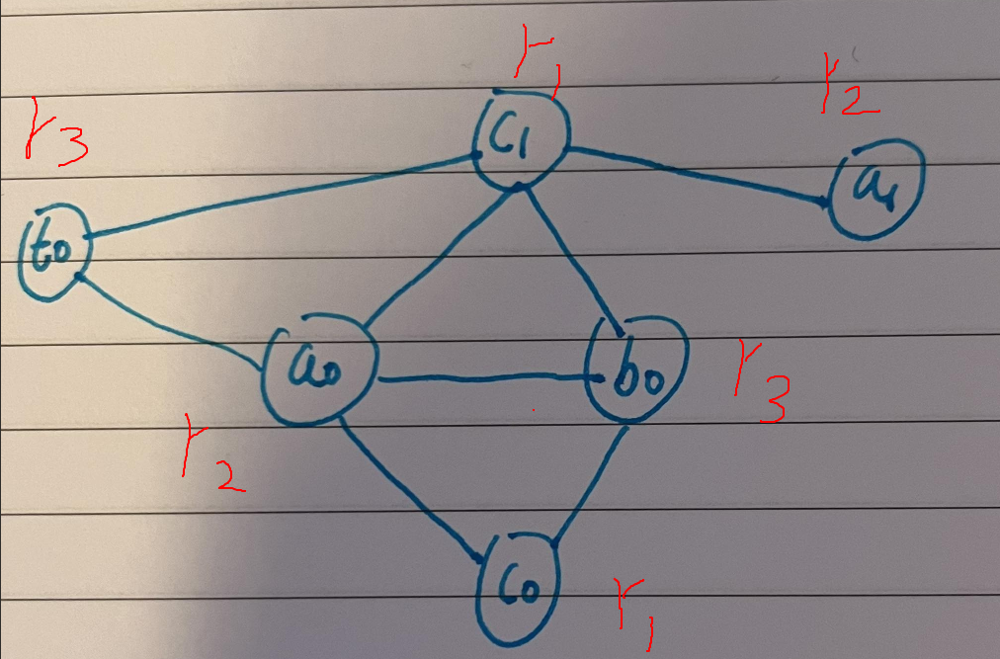

> Based on the work of TP answers from discord.

# Question 1

```
int f(int c) {
    int a = c * 2;
    int b = a + 1;
    c = c + b;
    a = b * 2 + a;
    return c + a;
}
```

**SSA**

```
f(c0):
    a0 = c0 * 2
    b0 = a0 + 1
    c1 = c0 + b0
    t0 = b0 * 2
    a1 = t0 + a0
    return c1 + a1
```

| f(c0)          | a0   | b0   | c0   | t0   | a1   | c1   |
|----------------|------|------|------|------|------|------|
| a0 = c0 * 2    |      |      | live |      |      |      |
| b0 = a0 + 1    | live |      | live |      |      |      |
| c1 = c0 + b0   | live | live | live |      |      |      |
| t0 = b0 * 2    | live | live |      |      |      | live |
| a1 = t0 + a0   | live |      |      | live |      | live |
| return c1 + a1 |      |      |      |      | live | live |

**IR**





**SSA**

```
f(r1):
    r2 = r1 * 2
    r3 = r2 + 1
    r1 = r1 + r3
    r3 = r3 * 2
    r2 = r3 + r2
    r0 = r1 + r2
    return r0
```

**Assembly**

```
f:
    mul r2, r1, 2
    add r3, r2, 1
    add r1, r1, r3
    mul r3, r3, 2
    add r2, r3, r2
    add r0, r1, r2
    ret
```

# Question 2

```
int x;   // stored at 0x10000
int y[10]; // the array is stored at 0x10004
void add(int v) {
    y[x] = v;
    x++;
}
```

**IR**

```
add(v0):
	w = *0x10000
	offset = w * 4 
	y0 = 0x10004 + offset
	*y0 = v0
	w1 = w + 1
	*0x10000 = w1
	return
```

Let us assume the variable `v0` is stored in `r1`

**SSA**

```
add(v0):
	w0 = *0x10000
	o0 = w0 * 4
	y0 = o0 + 0x10004
	*y0 = v0
    w1 = w0 + 1
    *0x10000 = w1
    return
```

| add(v0)           | v0   | w0   | o0   | y0   | w1   |
|-------------------|------|------|------|------|------|
| w0 = *0x10000     | live |      |      |      |      |
| o0 = w0 * 4       | live | live |      |      |      |
| y0 = o0 + 0x10004 | live | live | live |      |      |
| *y0 = v0          | live | live |      | live |      |
| w1 = w0 + 1       |      | live |      |      |      |
| *0x10000 = w1     |      |      |      |      | live |
| return            |      |      |      |      |      |

**SSA**

```
add(r1):
   	r2 = *0x10000
	r3 = r2 * 4
	r3 = r3 + 0x10004
	*r3 = r1
    r1 = r2 + 1
    *0x10000 = r1
    return
```

**Assembly**

```
add:
    load r2, 0x10000
    mul r3, r2, 4
    add r3, r3, 0x10004
    store r1, [r3]
    add r1, r2, 1
    store r1, 0x10000 // store the value r1 at the address 0x10000
    ret
```

# Question 3

```
int f(int v) {
    v = v + 2;
    return v*v;
}
int g(int a, int b) {
    int c = f(a);
    int d = 2*f(a+b);
    return c+d;
}
```

**IR**

```
g(a0, b0):
    t0 = a0 + 2
    c0 = t0 * t0
    t1 = a0 + b0
    t2 = t1 + 2
    t3 = t2 * t2
    d0 = 2 * t3
    return c0 + d0
```

# Question 4

```
x * 2 = x << 1			x * 3 = (x << 1) + x
x * 4 = x << 2			x * 5 = (x << 2) + x
x * 2n = x << n			x * (2n+1) = (x << n) + x
```

    
