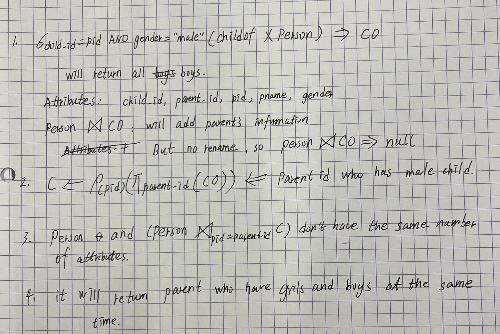
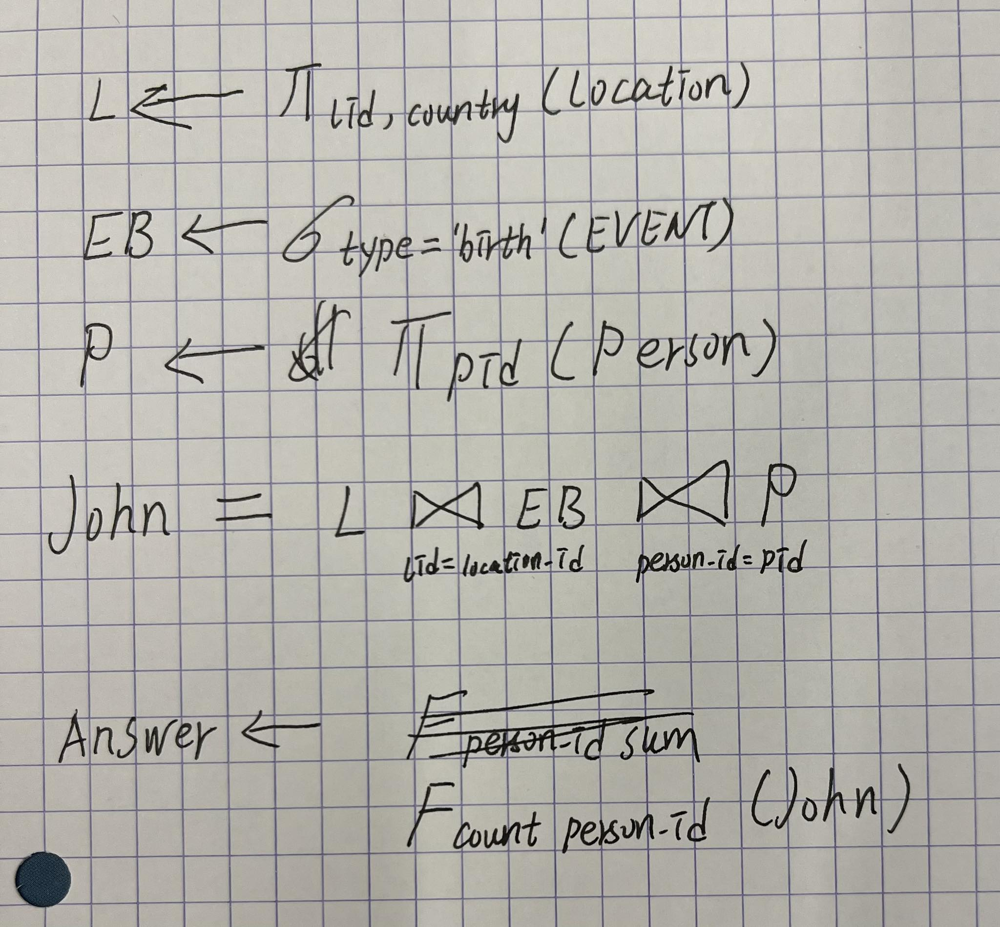

Class: LINFO2172
Created: May 29, 2023 4:18 PM
Reviewed: No

# **August 2019**

## **Part 1**

### **1**

The SQL query  is looking to find the names (pname) of 
persons from the Person table who are parents (pid = C.parent_id) 
but do not have a male child.

Answer: 

B

see 

### **2**

I need to evaluate the count function.
see [evaluating.sql](evaluating.sql)

> The test database's person's relation can be found [relation.jpg](2019-August/relation.jpg)

Answer:

