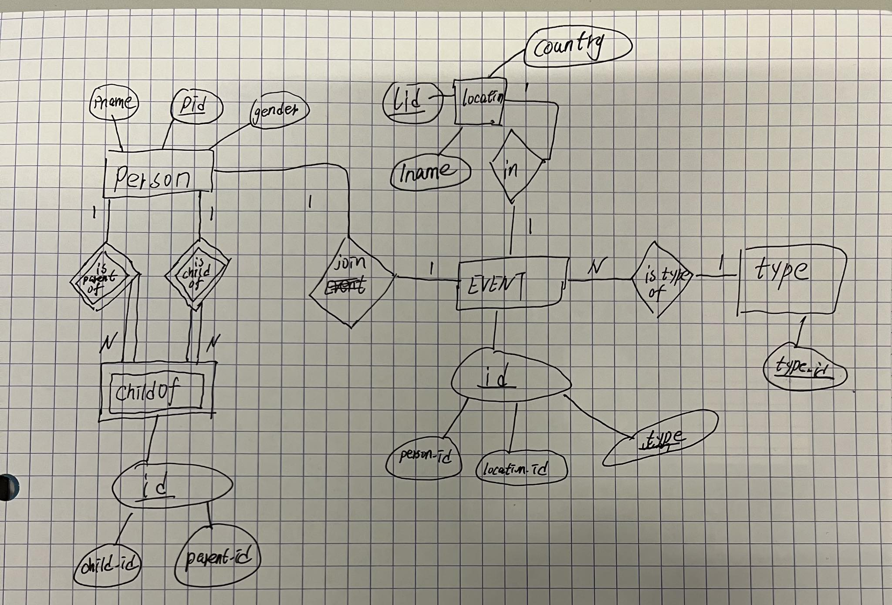

Class: LINFO2172
Created: May 29, 2023 4:18 PM
Reviewed: No

# **August 2019**

## **Part 1**

### **1**

The SQL query  is looking to find the names (pname) of 
persons from the Person table who are parents (pid = C.parent_id) 
but do not have a male child.

Answer: 

B

see 

### **2**

I need to evaluate the count function.
see [evaluating.sql](evaluating.sql)

> The test database's person's relation can be found [relation.jpg](2019-August/relation.jpg)

Answer:


### **3**

```sql
select child_id as p1, parent_id as p2
from ChildOf
union
select child_id as p1, parent_id as p2
from childOf,
     childOf as C
where parent_id = C.child_id;
```

### **4**



### **5**

It returns pairs of parent's name and child's name that the child's gender is female.

### **6**

One can always perform an algorithm that consists of the following steps:

1. Cascading selection
2. Commuting selection and pushing selection
3. Pushing projection
4. Introducing joins

To obtain an equivalent algorithm that is more efficient.

1. Cascading selection

   $$\pi_{pname}(S)$$
   $$T \leftarrow Person \times Event \times Location $$
   $$S \leftarrow \sigma_{pid=person\_id} (\sigma_{location\_id=lid}(\sigma_{country='Belgium'}(\sigma_{pid=100}(T))))$$


2. Computing selection and pushing selection

   $$\pi_{pname}(S) $$
   $$PE \leftarrow \sigma_{pid=person\_id}(\sigma_{pid=100}(Person)) \times Event$$
   $$T \leftarrow \sigma_{location\_id=lid}(\sigma_{country='Belgium'}(Location) \times PE) $$
   $$S \leftarrow T $$


3. Pushing Projection

   $$\pi_{pname}(S) $$
   $$P \leftarrow \pi_{pid, pname} (\sigma_{pid=100}(Person)) $$
   $$E \leftarrow \pi_{location_id, person_id} Event $$
   $$PE \leftarrow \pi_{location_id, pname} ( \sigma_{pid=person\_id}(P \times E))$$
   $$L \leftarrow \pi_{lid} (\sigma_{country="Belgium"}(Location) $$
   $$T \leftarrow \sigma_{lid=location\_id} (L \times PE) $$
   $$S \leftarrow T $$


4. Introducing joins

   $$\pi_{pname}(S) $$
   $$P \leftarrow \pi_{pid, pname} (\sigma_{pid=100}(Person)) $$
   $$E \leftarrow \pi_{location_id, person_id} Event $$
   $$PE \leftarrow \pi_{location_id, pname} (P \Join_{pid=person_id} E) $$
   $$L \leftarrow \pi_{lid} (\sigma_{country="Belgium"}(Location) $$
   $$T \leftarrow  (L \Join_{lid=location_id} PE) $$
   $$S \leftarrow T $$

### **7**

```sql
select COUNT(DISTINCT p.pid)
from Location L,
     Event E,
     Person P
where L.lname = "Torgny"
  And E.location_id = L.lid
  and E.person.id = P.person
  And P.gender = "male"
```

1. Location Table:
   - `lname`. This index helps locate the rows with the desired location name.
   - `lid`. This index speeds up the join operation between the Location and Event tables.
2. Person Table:
   - `gender`. This index allows for efficient filtering based on the gender condition.
   - `pid`. This index speeds up the join operation between the Person and Event tables.

> Note: We assume that the Event table's size is smaller than the Location and Person tables' sizes, so
> DBMS will scan the Event table and perform the join operation with the other two tables.

## **Part 2**

### **8**

Answer: A

### **9**

> This question's type is very unfamiliar to me, so skip it.

### **10**

**Explanation:**

*A*

**Sufficient condition:**

AB -> CDE => AB - C
DE -> AC => DE - A

**Necessary condition:**

We can't prove AB -> CDE, so there is no necessary condition.

**B**

**Sufficient condition:**

OK

**Necessary condition:**

We can't prove AB -> CDE, so there is no necessary condition.

**C**

**Sufficient condition:**

We can't prove A -> DE, so there is no sufficient condition.

**D**

**Sufficient condition:**

we can't prove A -> CDE, so there is no sufficient condition.

**E**

**Sufficient condition:**

AC-> DE and C -> A => C -> ADE

**Necessary condition:**

AB -> C && C -> ADE => AB -> CDE
C -> ADE => AC -> DE
C -> ADE => C -> A

> ==So the answer is E.==

### **11**

1. 1NF: Nested relations are not allowed.
2. 2NF: Every non-prime attribute is fully functionally dependent on the primary key.
   > An attribute is prime if it is part of the primary key.
3. 3NF: A relation is in third normal form if and only if every nontrivial full functional dependency X -> A in R
   - either X is a key
   - or A is a prime attribute.
4. BCNF: A relation is in Boys-Codd normal form iff every nontrivial full functional dependency X -> A in R, X is a key.

**Explanation:**

In this relation of this question, the candidate keys are AC and BC.

A can not determine B or C, vice versa, so B is fully functionally dependent on the primary key AC, and C is fully
functionally dependent on the primary key BC.

> I think the relation is in BCNF.

### **12**

