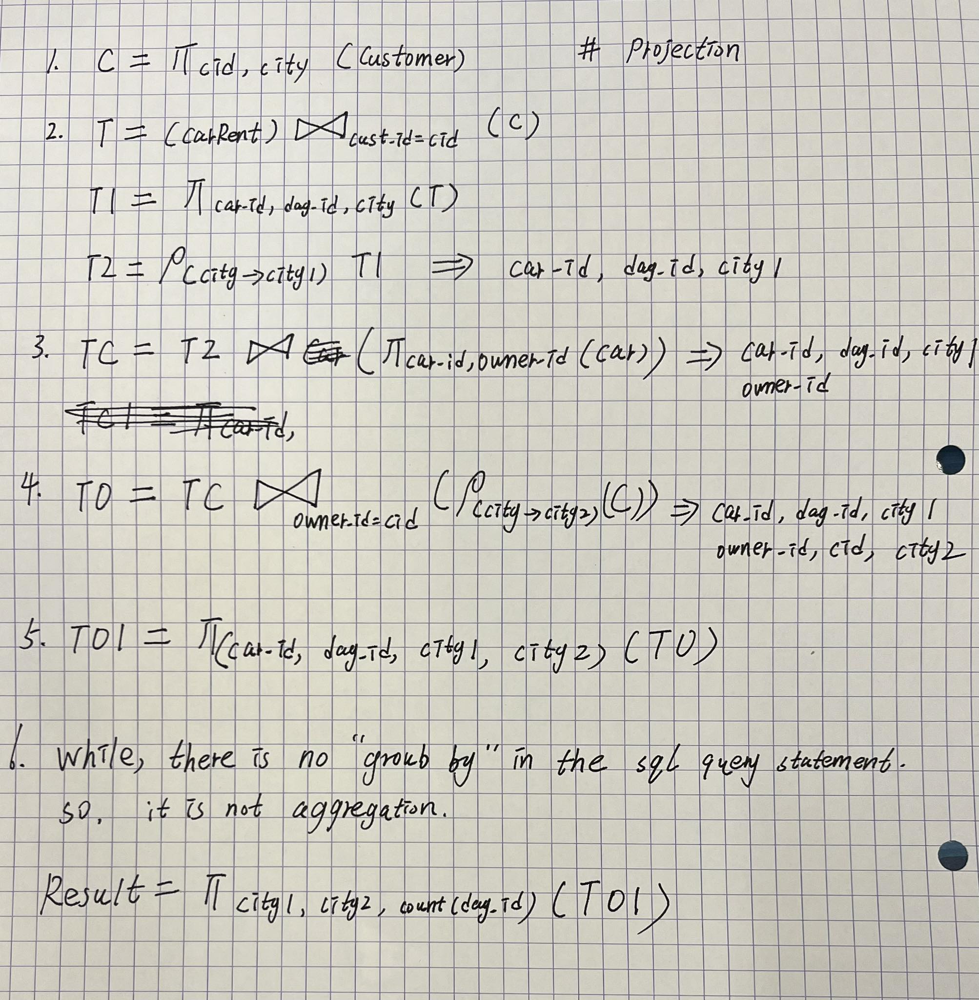
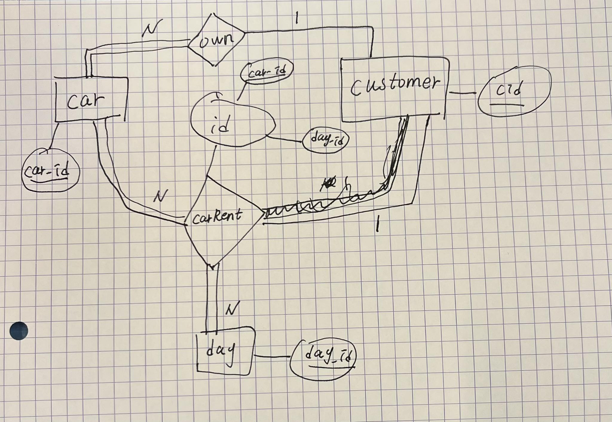
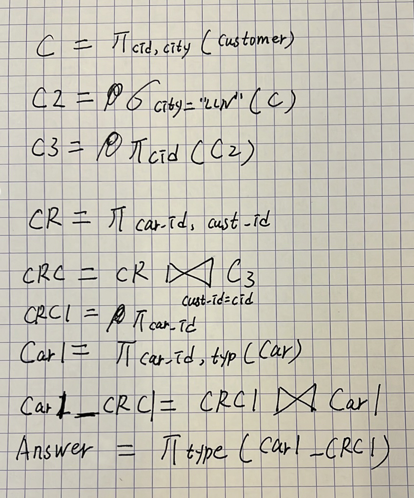
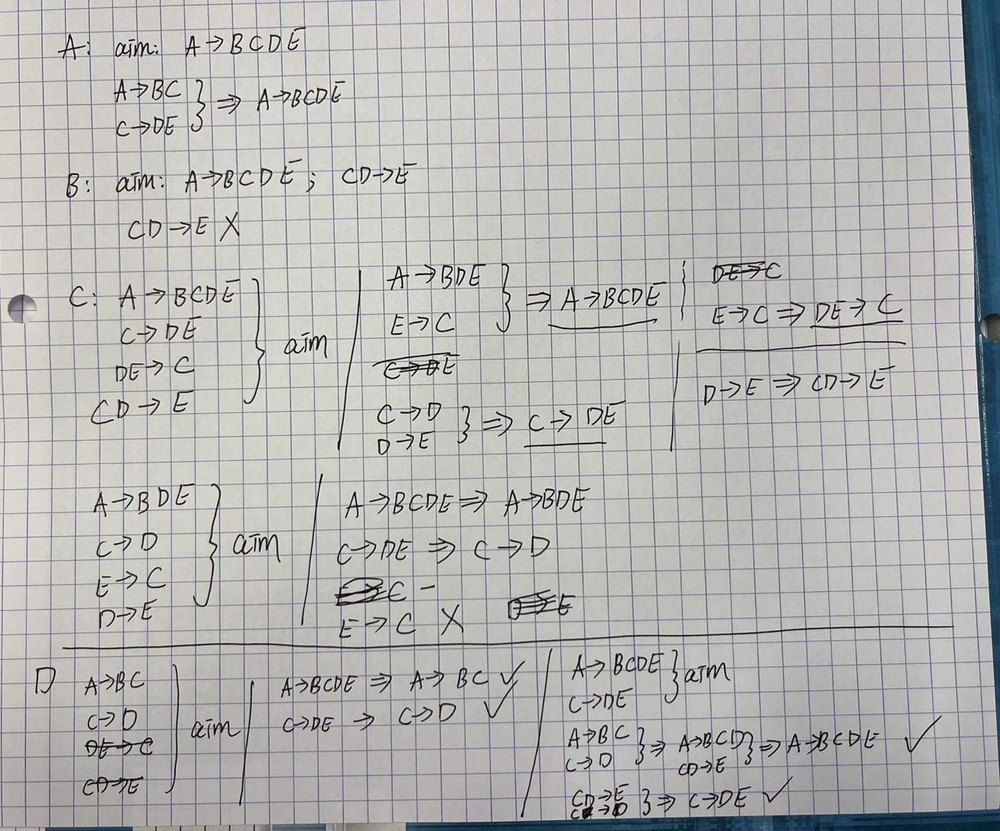

# Exam

Class: LINFO2172
Created: May 29, 2023 4:18 PM
Reviewed: No

# **June 2019**

## **Part 1**

**Explanation** of the database schema:

The owner of the car and the person who rented the car belong to the customer.


### **1**

```
SELECT CR.day_id, C.type, COUNT(DISTINCT CR.car_id)
FROM CarRent CR, Car C
WHERE CR.car_id = C.car_id
AND NOT EXISTS (
 SELECT *
 FROM Car C2
 WHERE C2.owner_id = C.cust_id
)
GROUP BY CR.day_id, C.type; # I assume the day means day_id
```

`CarRent` and `Car`: -> `car_id`, `cust_id`, `day_id`, `owener_id`, `type`.

group by: count the number of each type's car in each day rented.

<aside>
💡 For the fist question of exam in June 2019, the SQL query statement is not correct.

</aside>

<aside>
💡 There is no field `cust_id` in relation `Car`

</aside>

<aside>
💡 There is no field `day` in relation `CarRent`

</aside>

### **2**

```sql
select C1.City as City1, C2.City as City2, COUNT(DISTINCT CR.day)
from Customer C1,
     Customer C2,
     CarRent CR,
     Car C
where CR.cust_id = C1.cid
  AND CR.car_id = C.car_id
  AND C.owner_id = C2.cid.
```

**Explanation**:


`CR.cust_id = C1.cid`: get the customer's information

`CR.car_id = C.car_id AND C.owner_id = C2.cid.`: get the owner's information

so we can refactor the query:

```sql
select tenant.City as City1, owner.City as City2, COUNT(DISTINCT CR.day)
from Customer tenant,
     Customer owner,
     CarRent CR,
     Car C
where CR.cust_id = tenant.cid
  AND CR.car_id = C.car_id
  AND C.owner_id = owner.cid.
```

**Answer**: 




### **3**

```sql
select distinct cust_id as cid
from CarRent
intersect
select owner_id as cid
from Car c, CarRent cr
where c.car_id = cr.car_id
```

### **4**




### **5**

This query will return the owner's id who owns at least two cars.

### **6**

The relational algebra is used to query the types of cars that have been rented by customers who come from
"LLN".




### **7**

1. For car reservation relation, we need to use index on `day_id` and `cust_id` to speed up the query.
2. For customer relation, we need to use index on `cid` and `city` to speed up the query.

The indexes are enough to speed up the query, but it may not be necessary to create
indexes on `cust_id` in the car reservation relation if the number of car reservations is smaller than the number of customers.

DBMS can locate the tuples where day_id >= 50 by using index `day_id`.
DBMS can locate the tuples where city = "Bastogne" by using index city.

Then DBMS can join the two tables by using the index `cid` or `cust_id`.
The choice depends on the size of the two tables.

### **8**

Answer: B

### **9**

Answer: A B D

I am not sure about the answer of this question.

### **10**

Answer: A D

explain:



### **11**

Answer: 3NF

Explanation:

We get the following functional dependencies:

- AB -> C
- AC -> B
- C -> B

Let us assume AB is the primary key of the relation,
As C is fully dependent on AB, it is in 2NF.
C -> B is a partial dependency, but B is a prime attribute, so it is in 3NF.
C is not the primary key, so it is not in BCNF.

### **12**

Answer: 14

Explanation:

1024 / 100 = 10 records per block
100,000 / 10 = 10,000 blocks
log2(10,000) = 13 ...... 3 => 14

### **13**

Answer: A


### **14**

Answer: Hbase

Explanation:

Based on the output, we can see word `key=value`, so it is not a relational database.
We can see the world `column`, so it is very possible to be Hbase.

### **15**

- **_Relational databases provide ACID guarantees._**
- ~~Of the letters in ACID, I like the I the most. It stands for independence: all transactions run
independently of each other.~~
- ~~Relational databases cannot run in a distributed manner, that's why NoSQL is needed.~~
- **_There is not a clear definition of what a NoSQL database is. However, typically these databases
are distributed, or support a different data model than the relational data model._**
- ~~Among many NoSQL databases, MongoDB suits my needs the best: it allows to store data in a
distributed manner, supports JSON, and is highly available, which is more important than
consistency in our context.~~ MongoDB is is a CP system, so it is not highly available.
- ~~I think NewSQL is the future. As it's the newest technology, we are going to port our database to a NewSQL database.~~
- **_I like the fact that MongoDB provides a convenient library in JavaScript in which I can write
queries._**
- ~~I like the fact that SQL is standardized. Any query written for one database system, can be
executed on any other system~~

### **16**

~~`MATCH (c:PERSON)
RETURN c`~~ Return all nodes.

~~` MATCH (c:PERSON) - [:FRIENDS] -> (:PERSON)
RETURN c`~~ return a, b, c as they all have outgoing `Friends`

 ~~`MATCH (c:PERSON) - [:FRIENDS] -> (b:PERSON),
(:PERSON) - [:FRIENDS] -> (b: PERSON)
RETURN c`~~ return a and c 

 ~~`MATCH (c:PERSON) - [:FRIENDS] -> (b:PERSON)
MATCH (:PERSON) - [:FRIENDS] -> (b)
RETURN c`~~ return a, b, c

 ~~`MATCH (b:PERSON) - [:FRIENDS] -> (c:PERSON),
(:PERSON) - [:FRIENDS] -> (c: PERSON)
RETURN b`~~ return a, c

~~` MATCH (c:PERSON) - [:FRIENDS] -> (b:PERSON)
MATCH (b) - [:FRIENDS] -> (c)
RETURN c` ~~return b c

:dancers:***So there is no correct answer.***
