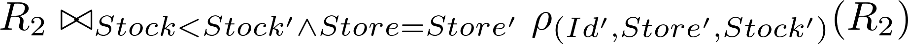

# Lecture 2_ Questions - [LINFO2172] Databases _ INGInious

Class: LINFO2172
Created: May 27, 2023 11:54 PM
Reviewed: No
Type: Reading

### Information

| Deadline | No deadline |
| --- | --- |
| Status | Not yet attempted |
| Grade | 0.0% |
| Grading weight | 1.0 |
| Attempts | 0 |
| Submission limit | No limitation |

Lecture 2: Questions

Collapse context

---

Paste this command into your terminal:

The password to connect is

Please answer to all the questions. Internal error {} has not a valid extension. {} is too heavy.

**Question 1: Output of Algebra Statement**

Consider the following expression in relational algebra:


Over two relations with schemas R1(Id,Name,Price) and R2(Id,Store,Stock). Relation R1 has the following tuples:

('1','Cheese','1.50')

('2','Apple','0.90')

('3','Chocolate', '2.0')

R2 has these tuples:

('1','LLN', 10)

('1','Brussels',20)

('2','LLN', 20)

('2','Brussels', 30)

Indicate all tuples that are in the output for this expression.

('2','Apple','0.90', 'LLN', 20)

('1')

***('1','Cheese','1.50')***

('2')

***('2','Apple','0.90')***

('1','Cheese','1.50', 'LLN', 10)

('3','Chocolate', '2.0')

Below is my analysis: Pi_ID(R2) => 1, 2. So R1 join Pi_id(R2) can be translate like 

```sql
select * from R1, 
(select id from R2) as t
where R1.id = t.id
```

**Question 2: Output of Algebra Statement**

Reconsider the database of the previous exercise. Which tuples are in the output of the following expression in relational algebra?



***('1','LLN', 10, '2', 'LLN', 20 )***

('1','LLN', 10, '1', 20)

***('1','Brussels', 20, '2', 'Brussels', 30)***

('1','Brussels', 20, '2', 30)

('2','LLN', 10, '2', 20)

('1','LLN', 10, '2', 20)

**Question 3: Output of Algebra Statement**

Reconsider the database of the first exercise. Which tuples are in the output of the following expression in relational algebra?


('1','Cheese','1.50', 'LLN', 10)

('1')

('1','Cheese','1.50')

('3')

***('3','Chocolate', '2.0')***

**Question 4: Equivalence of Algebra**

Given is the following expression in relational algebra, for a database with two relations R1(A,B) and R2(B,C). Indicate which expressions are equivalent to it.


**Question 5: Equivalence in Tutorial D**

Consider two relations R1(A,B,C) and R2(B,C,D), and the following statement in Turorial D:

((R1 JOIN R2) WHERE A=D) {A,B}

Which queries in Tutorial D are equivalent?

***(R1 JOIN (R2 RENAME { D AS A })) {A,B}***

***(R1 INTERSECT (R2 RENAME { D AS A })) {A,B}***

(R1 {A,B} JOIN (R2 {B,D} RENAME { D AS A }))

(R1 {A,B} INTERSECT (R2{B,D} RENAME { D AS A }))

**Question 6: Cross product**

Assume given the following query:

SELECT DISTINCT * FROM R1, R2

over a database with relations R1(A,B) and R2(B,C) that have the following tuples:

R1 ('1','x') ('2','x') ('2','y')

R2 ('x', 'q') ('x', 'r') ('y', 'q')

Indicate the number of tuples in the output relation.

3

5

***9***

6

**Question 7: Join**

Assume given the following query:

SELECT DISTINCT * FROM R1, R2 WHERE R1.B=R2.B

over a database with relations R1(A,B) and R2(B,C) that have the following tuples:

R1 ('1','x') ('2','x') ('2','y')

R2 ('x', 'q') ('x', 'r') ('y', 'q')

Indicate the number of tuples in the output relation.

3

***5***

9

6

Submit

**Share my result on:**×

Running INGInious v.0.8.6
© 2014-2023 Université catholique de Louvain.[INGInious is distributed under AGPL license](http://www.inginious.org/)

×