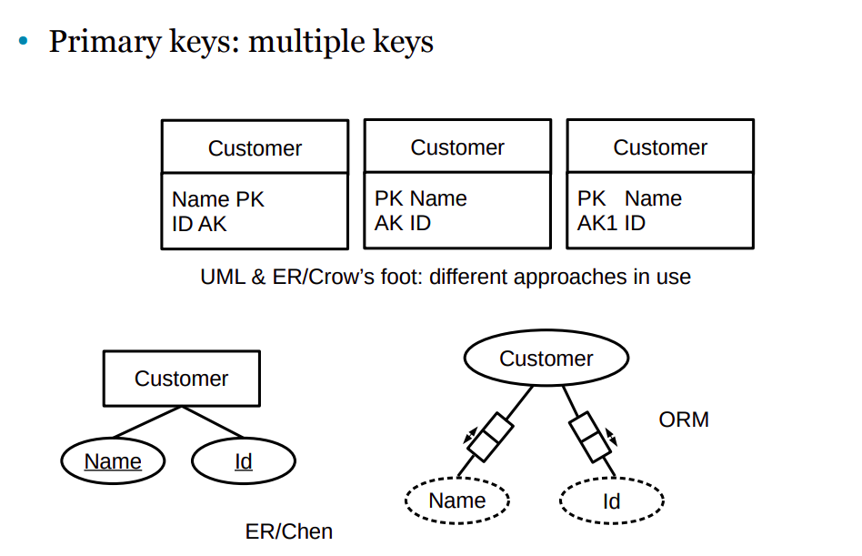

# Important knowledge points

## Lecture 1: Introduction, Relational Model

1. Database vs DBM

   A database is a structured collection of data that is organized and stored for easy retrieval, manipulation and
   analysis. It can be thought of a repository that stores information in a structured format, typically in tables
   consisting of rows and columns. Database are designed to efficiently manage large amounts of data and provide
   mechanisms for querying and modifying data.

   A DBMS is a software application or a set of software tools that enables the creation, maintenance, and utilization
   of databases. DBMS provides an interface between the users or applications and the underlying database, allowing
   users to interact with the data by defining, creating and manipulating databases. DBMS performs several essential
   functions, including data storage, data retrieval, data manipulation, data security, concurrency control, and
   transaction management. It provides mechanism for defining the structure of the database, specifying relationships
   between data elements, enforcing data integrity and optimizing the performance of data access and retrieval
   operators.

2. Abstraction

    1. Data Abstractions: This is where the complexity of data storage is abstracted away. Users of the database do not
       need to know how the data is stored in the physical storage media. They just have to understand the database in
       terms of a unified model, typically the relational model, which presents data in the form of tables. bulb
    2. Logical Abstraction: The scheme of relations in the database is abstracted, meaning that the user doesn’t
       necessarily see the schema of the database. The database schema defines the logical structure of the database,
       including the tables and relationships. However, a user can access and manipulate the data without knowing the
       underlying schema. Database administrators typically manage this level of abstraction. bulb
    3. Physical Abstraction: This involves abstracting the physical layout of the data. Databasers do not need to know
       where the data is physically stored and how it’s physically structured, whether it’s stored on an SSD, a spinning
       disk, or distributed across multiple physical locations.
   > Data abstraction concerns with hiding the overall complexities of data management, physical abstraction is
   specifically about abstracting away the details of the physical storage mechanisms.

3. ACID
    - Atomicity: The entire transaction takes place at once or doesn't happen at all.
    - Consistency: The database must consistent before and after transaction. All rules must be followed.
    - Isolation: Multiple transactions occur independently without interference.
    - Durability: The changes of a successful transaction occurs even if the system failure occurs.

## Lecture 2, 3: Relational Model

1. Multiset Semantics:
    - Intersection: if a tuple occurs n times in R and m times in S, then it occurs min(n, m) times in R ∩ S.
    - Difference: if a tuple occurs n times in R and m times in S, then it occurs max(n − m, 0) times in R − S.

   
   The proper way to solve this problem is:
   

2. NULL
    - ALL = {age | age = 19 or age != 19 or age is null}
    - No tuples included with a NULL value in the common attribute.
    - Set operations: Tuples are considered identical iff their values are identical, where **NULL is considered
      identical only to NULL**
    -

## Lecture 3: Query Optimization

One can always perform an algorithm that consists of the following steps:

1. Cascading selection
2. Commuting selection and pushing selection
3. Pushing projection
4. Introducing joins

see [example](https://github.com/DevRuibin/exams/blob/11a874563c2e07b7411988cbe5d40f93ea56b118/LINFO2172/2019-August.md?plain=1#L54)

## Lecture 4: Database Design

1. Add attributes: 
2. Relationship:  
3. Primary
   key:   
4. Weak entity: 
5. Full example: 
6. Conceptual design -> Physical design:
    - Convert entities: Convert the entities and all their singled-valued attributes.
    - Convert Weak entities: Convert the weak entities and all their singled-valued attributes. Add foreign key
      attributes for the owner entity.
    - Convert M:N relations: Create an additional relation with foreign key attributes for the connected entities.
    - Convert 1:1 relations: Add the key of one relation as a foreign key to the other. Or merge the two relations into
      one.
    - Convert 1:N relations: We can choose the method to convert 1:1 or M:N relations.
    - Convert Multivalued attributes: Create a new relation with the multivalued attribute as a key.

<aside>
💡 A unique key is often used to refer to a key that is unique but allows for null values, unlike a primary key. In SQL, NULL is considered distinct from other values, including other NULLs.

</aside>

<aside>
💡 A superkey is a set of one or more attributes that can uniquely identify records, but it can include extra, unnecessary attributes. A key is a minimal superkey, meaning it only contains the necessary attributes for unique identification.

</aside>

<aside>
💡 A prime attributes an attribute that is part of any candidate key, not just the primary key.

</aside>

## Lecture 5, 6, 7: Functional Dependencies

1. 1NF: Nested relations are not allowed.
2. 2NF: Every non-prime attribute is fully functionally dependent on the primary key.
   > An attribute is prime if it is part of the primary key. ? or if it is part of any candidate key.
3. 3NF: A relation is in third normal form if and only if every nontrivial full functional dependency X -> A in R
    - either X is a key
    - or A is a prime attribute.
4. BCNF: A relation is in Boys-Codd normal form iff every nontrivial full functional dependency X -> A in R, X is a key.

## Lecture 7, 8: Indexing

1. An index over multiple attributes can answer queries completely from the index, without accessing the relation.
2. B tree index is used to make search, insert and delete operations efficient.
3. For join operation, DBMS will choose the smallest relation to scan and build a hash table for the bigger relation.

**Example**:

1. 
2.

```sql
select COUN[exam] (exam)T(DISTINCT p.pid)
from Location L,
     Event E,
     Person P
where L.lname = "Torgny"
  And E.location_id = L.lid
  and E.person.id = P.person
  And P.gender = "male"
```

1. Location Table:
    - `lname`. This index helps locate the rows with the desired location name.
    - `lid`. This index speeds up the join operation between the Location and Event tables.
2. Person Table:
    - `gender`. This index allows for efficient filtering based on the gender condition.
    - `pid`. This index speeds up the join operation between the Person and Event tables.

> Note: We assume that the Event table's size is smaller than the Location and Person tables' sizes, so
> DBMS will scan the Event table and perform the join operation with the other two tables.

## Lecture 9: Concurrency & Programming

1. Undo/Redo-log: 
2. Two-phase locking: Require that all transactions acquire all locks before releasing any lock.

### Programming

1. Embedded SQL: Extend common programming languages with syntax allowing to embed SQL. It needs a preprocessor to
   translate the embedded SQL statements into standard SQL statements.
2. Libraries: Don't require additional functionality in the host language. It integrates SQL Queries as strings.
3. Object-relational mapping: It maps objects to relational tables. For example, Hibernate, etc.
4. Query builders: Similar to ORM, but these libraries also allow to write queries using function calls. For example:
   JOOQ, etc.

**pros and cons**


## Lecture 10, 11, 12: NoSQL, NewSQL


**Key-value stores**

1. Document stores: semi-structured data, JSON, XML, etc.
    - MongoDB
        - CP
        - replication
        - sharding(horizontally partitioning)
        - one primary node and multiple secondary nodes
    - CouchDB
        - AP
        - All nodes are equal
        - replication
2. Generic key-value stores:
    - Amazon DynamoDB
        - AP
        - Horizontally partitioning
    - Redis
    - Voldemort
3. Column stores: provide vertical partitioning.
    - Cassandra
        - AP
    - HBase
        - CP
    - replication
        - cp
    - Hypertable
        - CP

## Lecture 11: Relational Extensions

1. Object-oriented databases
2. Temporal databases
3. Spatial databases
4. Data Lakes, Data Warehouses

Data lakes are not easy to analyse, many different data formats, highly unstructured, etc. => Data Swamp

A data warehouse is a structured database maintained for decision support applications.

ETH:

- Extract from other databases
- Transform into standard format
- Load into data warehouse

Drill-up: generalization of a cuboid

Drill-down: specialization of a cuboid

Pivot: rotate the cube

Dice: select a subcube by reducing the number of considered values of an attribute.

slice: select a subcube by fixing the value of one attribute 